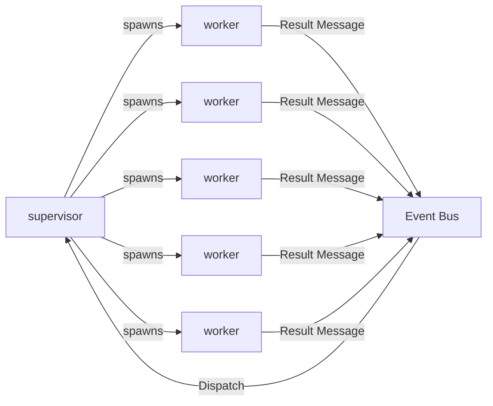
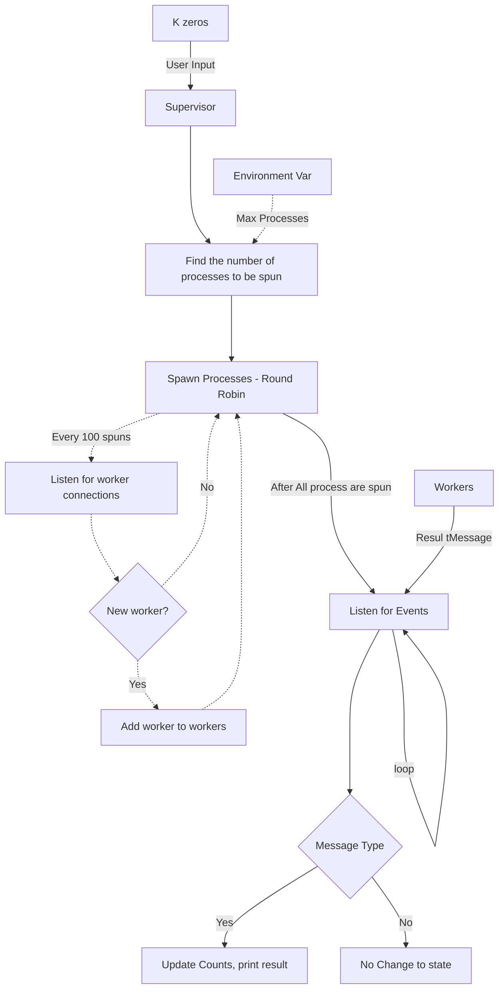
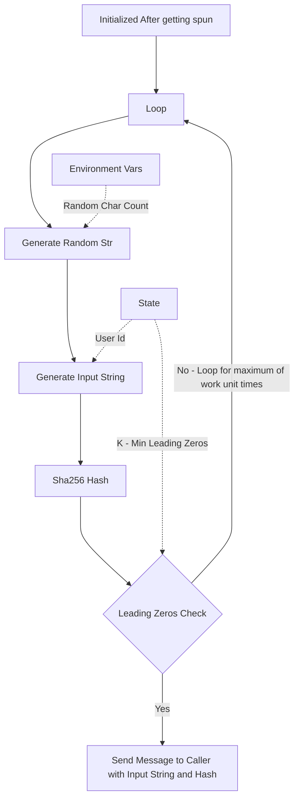
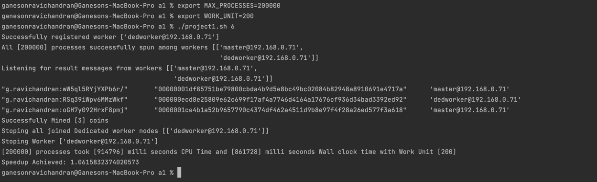
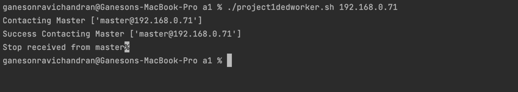
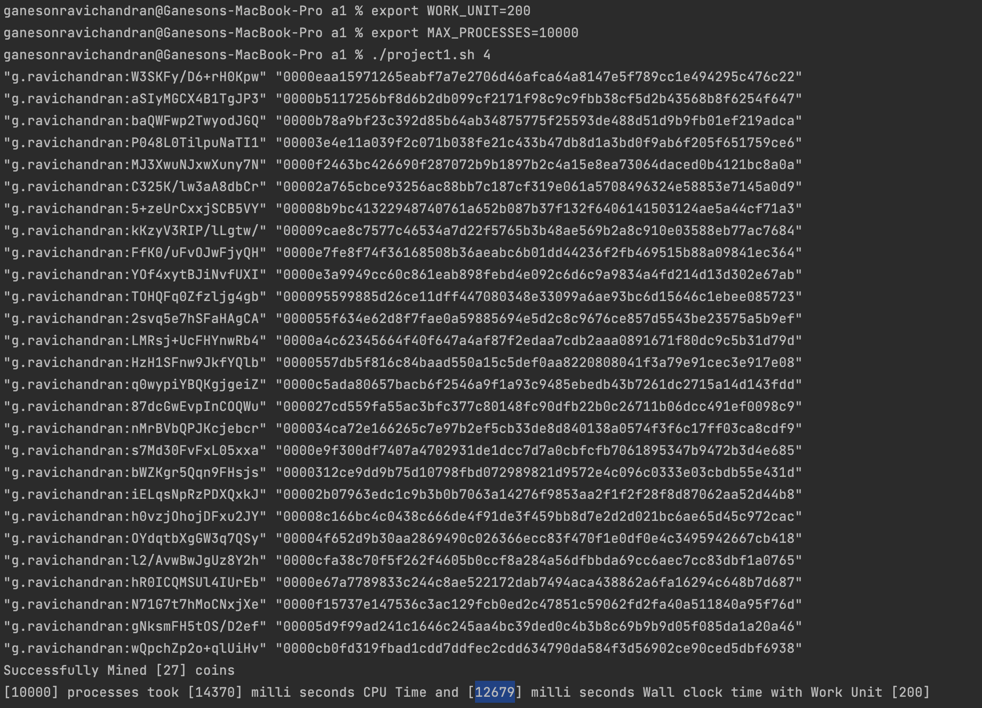
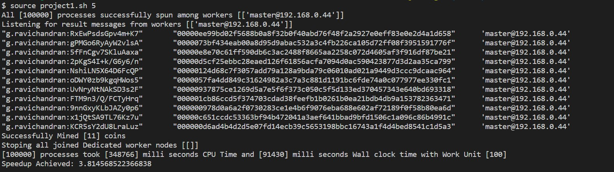
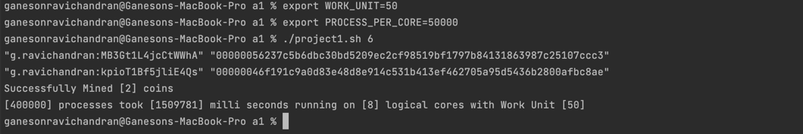

## Erlang Bitcoin Mining Simulation.

This is the actor model based bitcoin mining system in erlang submitted in response
to [project 1](https://ufl.instructure.com/courses/467300/assignments/5383668)
of [COP5615](https://ufl.instructure.com/courses/467300).

#### Team

| Name                     | Gator Email             | UF Id     | Github username |
|--------------------------|-------------------------|-----------|-----------------|
| Ravichandran, Ganeson    | g.ravichandran@ufl.edu  | 10798982 | GANES1998       |
| Munaga, Sai Pavan Kalyan | saipavank.munaga@ufl.edu | 88769245 | saipavankalyan  |

#### Architecture



- Supervisor receives K, the expected number of leading zeros in the hash for mining and spawns out a number of workers.
- Each worker computes and shares the result, success if a said hash with K leading zeros is found or nosuccess if such
  hash is not found.

#### Architecture of Supervisor



#### Architecture of Worker



#### Steps of Execution

1. Fill the [constants.env](constants.env) with appropriate values.

   | Variable Name         | Use                                                                                                        |
   |-----------------------|------------------------------------------------------------------------------------------------------------|
   | MASTER_NODE           | Node name of the master node of format name@ip                                                             |
   | ERLANG_COOKIE         | Cookie used to sync two nodes to same network                                                              |
   | DEDICATED_WORKER_NODE | Node name of the dedicated worker node.<br/> Required when having a dedicated worker node                  |
   | ERLANG_BIN            | Absolute path to erlang bin.                                                                               |

2. Execute ```./project1.sh K``` where `K` is the number of leading zeros expected.
3. In another node - dedicated worker node, execute ```./project1dedworker.sh ip``` where `ip` is the ip of the server.
| [](doc/assets/3_speedup.jpg)
*Note*

The server is assumed to have a name of master. The server name should be master@ip.

**Supervisor Side**



**Worker Side**




#### Answers

1. Size of the work unit that you determined results in the best performance for your implementation and an explanation
   of how you determined it. The size of the work unit refers to the number of sub-problems that a worker gets in a
   single request from the boss.

I tried multiple work units from 10, 50, 100, 200 and appropriately reducing the process per core so that the attempts
remain the same.
The corresponding wall clock times were used to determine the best value of Work Unit. The results of this experiment
are tabulated below.

| Work Unit |  Max Process Spun | Max Attempts | Bitcoins Mined | Wall Clock Time (ms) |
|-----------|-------------------|--------------|----------------|----------------------|
| 10        |  200000           | 2000000      | 28             | 146667               |
| 50        |  40000            | 2000000      | 21             | 19182                |
| 100       |  20000            | 2000000      | 30             | 13717                |
| 200       |  10000            | 2000000      | 30             | 12616                |
| 500       |  2000             | 2000000      | 10             | 5744                 |

So, when the work unit 200, we have a perfect balance of Bitcoins mined and Time Taken. So, I have chosen 50 as the work
unit.

2. The result of running your program for input 4

From the above experiment, the work unit was set to **50** and hence the process per core was set to 5000. The result of
the program is shown below.

| Work Unit | Max Process Spun | Max Attempts | Bitcoins Mined | Wall Clock Time (ms) |
|-----------|------------------|--------------|----------------|----------------------|
| 200       | 10000            | 2000000      | 27             | 12679                |



3. The running time for the above is reported by time for the above and report the time. The ratio of CPU time to REAL
   TIME tells you how many cores were effectively used in the computation. If you are close to 1 you have almost no
   parallelism (points will be subtracted).



4. The coin with the most 0s you managed to find.
   We were able to mine a coin with 6 leading zeros. The run is as follows.

| Work Unit | Max Process Spun | Max Attempts | Bitcoins Mined | Wall Clock Time (ms) |
|-----------|------------------|--------------|----------------|----------------------|
| 200       | 200000           | 40000000     | 2              | 1509781              |



5. The largest number of working machines you were able to run your code with.

Since, we are a group of two persons, I tried using working machines. The results are as follows.

| Work Unit | Max Process Spun | Max Attempts | Bitcoins Mined (leading 6) | Wall Clock Time (ms) |
|-----------|------------------|--------------|----------------------------|----------------------|
| 200       | 200000           | 40000000     | 3                          | 861728               |
