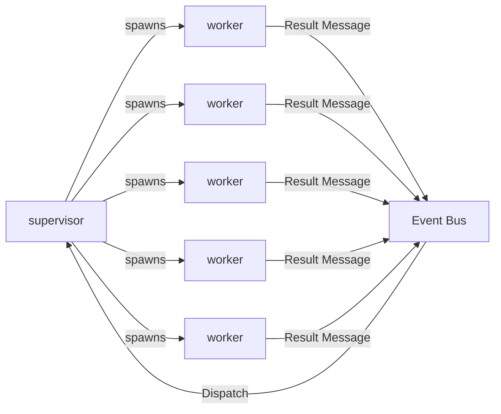
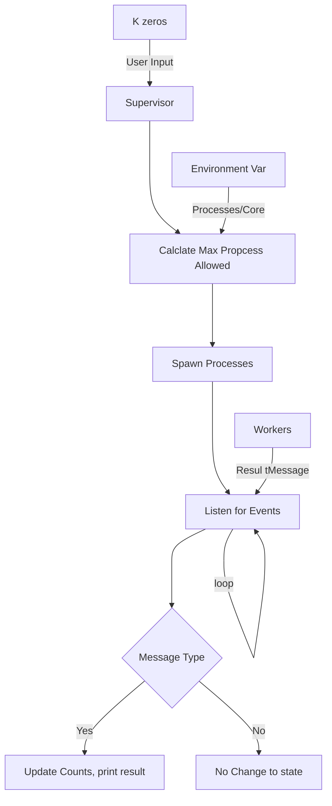

## Erlang Bitcoin Mining Simulation.

This is the actor model based bitcoin mining system in erlang submitted in response to [project 1](https://ufl.instructure.com/courses/467300/assignments/5383668) of [COP5615](https://ufl.instructure.com/courses/467300).

#### Team

| Name                     | Gator Email             | UF Id     | Github username |
|--------------------------|-------------------------|-----------|-----------------|
| Ravichandran, Ganeson    | g.ravichandran@ufl.edu  | 1079-8982 | GANES1998       |
| Munaga, Sai Pavan Kalyan | saipavan.munaga@ufl.edu | xxxx-xxxx |                 |

#### Architecture



- Supervisor receives K, the expected number of leading zeros in the hash for mining and spawns out a number of workers.
- Each worker computes and shares the result, success if a said hash with K leading zeros is found or nosuccess if such hash is not found.

#### Architecture of Supervisor


#### Architecture of Worker
```mermaid
graph TR;

```